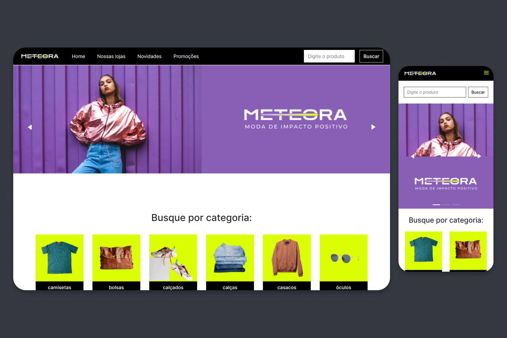

<h1 align="center">
    <br>
    
</h1>

<h4 align="center">
    Alura Challenge Front-End 🤿
</h4>

<p align="center">
    
    
    
</p>

<h1 align="center">
    
</h1>

# Meteora 
A Meteora é uma empresa do comércio eletrônico de roupas atemporais, casuais e sem gênero. Ela acredita que a moda é muito mais do que apenas tendências passageiras e oferece peças versáteis que se adaptam a qualquer estilo e ocasião.

## 🛠️ Tecnologias

Esse projeto foi desenvolvido com as seguintes tecnologias:

- CSS Modules
- [Vite](https://vitejs.dev/)
- [Sass](https://sass-lang.com/install)
- [TypeScript](https://www.typescriptlang.org/)
- [Swiper](https://swiperjs.com/get-started)
- [Axios](https://axios-http.com/docs/intro)
- [Yup](https://www.npmjs.com/package/yup)

## 🚀 Como executar

Clone o projeto e acesse a pasta do mesmo.

```bash
$ git clone https://github.com/pejamp/meteora-alurachallenge
$ cd meteora-alurachallenge
```

Para iniciá-lo, siga os passos abaixo:
```bash
# Instalar as dependências
$ npm install

# Iniciar o projeto
$ npm run dev
```

## 🌐 Projeto

- [Deploy](https://meteora-alurachallenge-pedrojrodrigues.vercel.app/)

## 👨‍💻 Autor

<a href="https://github.com/pejamp">
 
 <br />
 <sub><b>Pedro Rodrigues</b></sub>
</a> 
<a href="https://github.com/pejamp"></a>
<br />

## Contact me!

[](https://www.linkedin.com/in/pedro-rodrigues-3a3647176/)
[](mailto:pedro.roguea@gmail.com)
